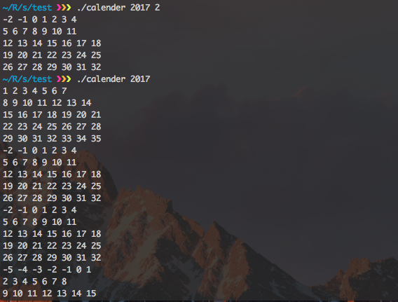
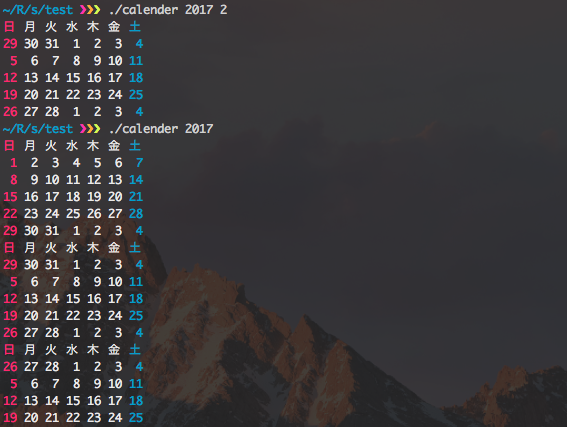

前回はcalenderコマンド作ってるときに調べた内容をまとめた。

今回はその作成過程を書いてく。

様々なつらみがあった..


## calenderコマンドを作った
- zshから実行してる
- シバン(下で説明する)は```#!/bin/bash```
- まずは結果から


## dateコマンドのBSD系とGNU系での違いにはまった
- めっちゃ時間取られたマジふざけんな
- まあ自業自得


### オプションの違いについて
- よくわからないけどGNU系とかBSD系とか色々あるらしい
- POSIXの仕様にない実装があるからっぽい？
- だからPOSIX原理主義者とかいるのかな..
- [FreeBSDとLinuxでの、dateコマンドの日付を指定したepoch扱い · GitHub](https://gist.github.com/ozuma/7961472)
- 曜日を取得したかったので```+%w```
- ちなみにフォーマット指定は```+```から始まって```%Y```とか```%m```とか使える
- GNU系 ```date -d "2017-01-15" "+%w" ```
- BSD系 ```date -j -f "%Y-%m-%d" "2017-01-15" "+%w"```
- 日付設定しない```-j```オプションと、日付フォーマット指定の```-f```オプション


### OSの判定について
- [シェルスクリプトでOSを判別する - Qiita](http://qiita.com/UmedaTakefumi/items/fe02d17264de6c78443d)
- ここによると判定には$(uname)が使えるそうな
- OSごとにdateを書き換えた
- ここで関数を使いたかったが、上記のように関数って使いにくそう
- 文字列でゆく
```bash
if [ "$(uname)" == "Darwin" ]; then
  strdate="date -j -f "'"%Y-%m-%d" '
else
  strdate="date -d "
fi

date='"2017-01-15"'
echo `$strdate$date "+%Y-%m-%d"`
```


## calenderコマンドの仕様を考えた
- 仕様のまとめ方未だに分からない
- なので適当に書く
```
$ calender
# => 今月のカレンダー
$ calender <year>
# => 指定年のカレンダー
$ calender <year> <month>
# => 指定月のカレンダー
$ calender <year> <month> <day>
# => 指定付きのカレンダー、日付をハイライト
```
- 曜日表示させたい
- あとそれぞれのカレンダーの上に何月かも表示させたい


## とりあえずカレンダーの原型作った
```bash
#!/bin/bash

if [ "$(uname)" == "Darwin" ]; then
  strdate="date -j -f "'"%Y-%m-%d" '
else
  strdate="date -d "
fi

year="$1"
month="$2"
date="$3"

if [ "$year" = "" ]; then       # $ calender
  date='"'`date "+%Y-%m-%d"`'"'
  year=`$strdate$date "+%Y"`
  month=`$strdate$date "+%m"`
  date=`$strdate$date "+%d"`
  from=$month
  to=$month
elif [ "$month" = "" ]; then     # $ calender <year>
  from=1
  to=12
elif [ "$date" = "" ]; then      # $ calender <year> <month>
  from=$month
  to=$month
fi

# 何月か
seq $from $to | while read month; do
  firstdate='"'"$year-$month-01"'"'
  firstday=`$strdate$firstdate "+%w"`
  # 第何週か
  seq 0 4 | while read n; do
    offset=$((n * 7 - firstday))
    echo $(seq $((1 + offset)) $((7 + offset)));
  done
done

```
- 何回も動作確認しながら作った
- そのとき調べたことをまとめたのが上に書いたやつ


- ずれてるので桁そろえたい


## 桁をそろえた
- ```seq```のオプションで桁そろえられるらしい
```bash
# 第何週か
seq 0 4 | while read n; do
  offset=$((n * 7 - firstday))
  echo $(seq -f %02g $((1 + offset)) $((7 + offset)));
done
```
- これは後で気付いたけど、0埋めすると計算に使ったとき8進数と解釈されてエラー吐く
- ```value too great for base error token is 08```みたいなエラー
- まあ取り敢えず進む


## 色を付けようとしてechoの罠にはまった
- さっきのdateと同じでPOSIXから外れた拡張実装の違いではまったよ
- 2度あったことなので3度目ありそう
- 次からオプションとかでエラー出たらPOSIX標準か独自拡張かちゃんと調べよ..


### echoでの色付けについて
- [シェル - echoで文字に色をつける その1 - Miuran Business Systems ](シェル - echoで文字に色をつける その1 - Miuran Business Systems )
```bash
hoge=hoge
echo -e "\e[31m${hoge}\e[m"
# => -e "\e[31m${hoge}\e[m"
```
- ファッツ
- なんでオプションごと```echo```されとんねん
- ```/bin/echo```って指定するといけるよって言ってるサイトもあったけど
- 散々調べた結果、BSD系の```echo```に```-e```なんていうオプションはないことが判明
- [CentOS7とOS X Mavericksのechoコマンドの違いについて - はらへり日記](http://sota1235.hatenablog.com/entry/2015/08/07/235824)
- ここにたどり着いた
- まあよくわからないけど、```printf```で同じことできるしGNU系とBSD系で動作も同じらしい
- そして```printf```を使うことになったのでした..
```bash
COLOR_OFF="\033[0m"
COLOR_RED="\033[31m"
COLOR_BLUE="\033[34m"
COLOR_WHITE="\033[37m"

seq $from $to | while read month; do
  firstdate='"'"$year-$month-01"'"'
  firstday=`$strdate$firstdate "+%w"`
  seq 0 4 | while read n; do
    offset=$((n * 7 - firstday))
    echo $(seq $((1 + offset)) $((7 + offset)) | while read date; do
      day=$((date - offset))
      if [ "$day" = 1 ]; then
        printf "$COLOR_RED";
      elif [ "$day" = 7 ]; then
        printf "$COLOR_BLUE";
      else
        printf "$COLOR_WHITE";
      fi
       printf %2d $date;
       printf "$COLOR_OFF\n";
    done);
  done
done

```
- 文字色を土曜日は青色に、日曜日は赤色にした
- ついでに0埋めを空白埋めにした


## 曜日を表示させた
```bash
seq $from $to | while read month; do
  firstdate='"'"$year-$month-01"'"'
  firstday=`$strdate$firstdate +%w`
  days=$(seq 1 7 | while read i; do
    date='"'"$year-$month-$((i - firstday + 7))"'"'
    echo `$strdate$date +%a`;
  done)
  echo $days
  seq 0 4 | while read n; do
    offset=$((n * 7 - firstday))
    echo $(seq $((1 + offset)) $((7 + offset)) | while read date; do
      day=$((date - offset))
      if [ "$day" = 1 ]; then
        printf "$COLOR_RED";
      elif [ "$day" = 7 ]; then
        printf "$COLOR_BLUE";
      else
        printf "$COLOR_WHITE";
      fi
       printf %2d $date;
       printf "$COLOR_OFF\n";
    done);
  done
  echo ""
done
```
- まあ、曜日のシーケンス作って表示しただけ
- 特に書くこともない
- 曜日も日付と同じに色付けしたい


## マイナスとか31日超えた日付をどうにかした
- 今マイナスの日付とか、32日とかある
- 僕の夏休みかよ..
- dateコマンドでなんとか過不足の日付を先月、来月の日付にできないだろうか..
- ついでに文字色も灰色とかにしときたいよね


### dateの使い方について
```bash
# GNU系
date -d "2017-01-15 +15days" +%Y-%m-%d
# => 2017-01-29

date -d "2017-01-15 +20days" +%Y-%m-%d
# => 2017-02-04

date -d "2017-01-15" -14days" +%Y-%m-%do
# => 2017-01-01

date -d "2017-01-15" -15days" +%Y-%m-%do
# => 2016-12-31

date -d "2017-01-15" -20days" +%Y-%m-%do
# => 2016-12-26
```
- いやー完璧ですね、これはいける
```bash
# BSD系
date -j -v-20d -f %Y-%m-%d "2017-01-15" +%Y-%m-%d
# => 2016-12-26

date -j -v+20d -f %Y-%m-%d "2017-01-15" +%Y-%m-%d
# => 2017-02-04
```
- これは勝った、もう```mydate```関数自作まったなし
- mydate関数作るのに結構つまづいたから次の章にいく


### mydate関数について
#### 仕様
- ```date```が使いづらいので関数つくる
```
$ mydate
2017-01-15
$ mydate 2017-01-01
2017-01-01
$ mydate 2017-01-15 20
2017-02-04
$ mydate 2017-01-15 -20
2016-12-26
```

#### 引数
- 引数のチェックやった
```bash
#!/bin/bash
set -eu

mydate() {
  local readonly f=%Y-%m-%d
  local readonly ifD=`[ "$(uname)" = "Darwin" ]`
  local opts=`$ifD && echo "-j -f $f"` || echo "-d"
  set +eu
  date $opts "$1" >/dev/null 2>&1
  local date=`[ $? != 0 ] && echo $(date +$f) || echo $1`
  expr 1 + "$2" >/dev/null 2>&1
  local days=`[ $? -ge 2 ] && echo 0 || echo $2`
  set -eu

  echo $date
  echo $days
}
```
- [シェルスクリプトで変数が数値かどうかチェック - 計算物理屋の研究備忘録](http://keisanbutsuriya.hateblo.jp/entry/2015/01/18/192435)
- [シェルスクリプト数字判定 - eTuts+ Server Tutorial](http://server.etutsplus.com/sh-is-numric/)
- ```set +eu```でオプションを一時的に解除
- ```set -e```があると未定義で```$n```を使った時にエラーが出る
- 今回は未定義でもコマンドが実行できなければ困るので解除
- ```$ calender```とか
- ```set -u```があるとエラーが出たとき処理を中断する
- 今回はわざとエラーを吐かせて引数のチェックを行っているので解除
- ```date $opts "$1" >/dev/null 2>&2```について
- どんな処理でも```/dev/null```にリダイレクトするとエラーを握りつぶせる
- これを利用して、```$?```で返り値を取得し、引数が正しいか判定する
- ```date```は成功したときは0、失敗したときは1を返す
- ```expr```は算術演算 (```$(())```と同じ)
- 今回の場合```$(())```を使うと何故かエラーが出た
- あと```expr```は引数の式中の演算子の両端にスペース入れないとおかしな動きした
- ```expr "$days"+1```ってすると2が返るべきなのに0が返ってくる
- ```expr```は答えが0以外のとき1、0のとき1、そもそも計算に失敗したとき2または3を返す
- ちなみに```1 + "$days"```は計算順序を逆にすると、```$2```が空文字列のとき```+ 1```となってエラーが出てくれないので注意
- ここにたどり着くまでめっちゃ時間かかった..
- ここからいよいよ```date```コマンドを組み立てる

#### dateコマンドの組み立て
- どうでもいいけど今15日から16日になった
```bash
mydate() {
  local readonly f=%Y-%m-%d
  local readonly ifD=`[ "$(uname)" = "Darwin" ]`
  local opts=`$ifD && echo "-j -f $f"` || echo "-d"
  set +eu
  date $opts "$1" >/dev/null 2>&1
  local date=`[ $? != 0 ] && echo $(date +$f) || echo $1`
  expr 1 + "$2">/dev/null 2>&1
  local days=`[ $? -ge 2 ] && echo 0 || echo $2`
  set -eu

  local days=`[ 0 -le $days ] && echo +$days || echo $days`
  local opts=`$ifD && echo "-j -v${days}d -f $f $date +$f" || echo "-d $date${days}days +$f"`
  echo `date $opts`
}

mydate
# => 2017-01-16

mydate 2017-01-01
# => 2017-01-01

mydate 2017------
# => 2017-01-16

mydate 2017-01-16 20
# => 2017-02-05

mydate 2017------ -20
# => 2016-12-27

mydate "" 20
# => 2017-02-05

mydate 2017-01-16 +20
# => 2017-01-16
```
- いい感じ
- でも最後のだけおしいな..
- ```mydate 2017-01-16 +20```みたいに```+```ついてても動いてほしい
- そういえばフォーマットの指定を失念していたぜ
```bash
mydate() {
  local readonly inf=%Y-%m-%d
  local readonly ifD=`[ "$(uname)" = "Darwin" ]`
  local opts=`$ifD && echo "-j -f $inf"` || echo "-d"
  set +eu
  date $opts $1>/dev/null 2>&1
  local date=`[ $? != 0 ] && echo $(date +$inf) || echo $1`
  expr 1 + $2>/dev/null 2>&1
  local days=`[ $? -ge 2 ] && echo 0 || echo $2`
  date $opts $date +$3>/dev/null 2>&1
  local outf=`[[ $? != 0 || $3 = "" ]] && echo $inf || echo $3`
  set -eu

  echo 'outf: '$outf

  local days=`[ 0 -le $days ] && echo +$days || echo $days`
  local opts=`$ifD && echo "-j -v${days}d -f $inf $date +$outf" || echo "-d $date${days}days +$outf"`
  echo `date $opts`
}

mydate 2017-01-16 0 %w
# => 0

mydate 2017-01-16 0 %y
# => 17
```
- さっきと同じように引数をチェック
- ```f```を```inf```(input format)と```outf```(output format)に分けた
- ```[ $? != 0 -o $3 = "" ]```ってするとなぜか```[: too many arguments```と言われた
- ので```[[ ]]```と```||```使った
- この関数を使うんだけど、他のとこも結構書き直したので次の章にいく


## いっきに書き換えた
- 曜日も色付けした
- さっき作った```mydate```関数使っておかしな日付をもどした
```bash
#!/bin/bash
set -eu

mydate() {
  local readonly inf=%Y-%m-%d
  local readonly ifD=`[ "$(uname)" = "Darwin" ]`
  local opts=`$ifD && echo "-j -f $inf"` || echo "-d"
  set +eu
  date $opts $1>/dev/null 2>&1
  local date=`[ $? != 0 ] && echo $(date +$inf) || echo $1`
  expr 1 + $2>/dev/null 2>&1
  local days=`[ $? -ge 2 ] && echo 0 || echo $2`
  date $opts $date +$3>/dev/null 2>&1
  local outf=`[[ $? != 0 || $3 = "" ]] && echo $inf || echo $3`
  set -eu

  local days=`[ 0 -le $days ] && echo +$days || echo $days`
  local opts=`$ifD && echo "-j -v${days}d -f $inf $date +$outf" || echo "-d $date${days}days +$outf"`
  echo `date $opts`
}

# 定数
readonly OFF="\033[0m"
readonly RED="\033[31m"
readonly BLUE="\033[34m"
readonly WHITE="\033[37m"
readonly now=`date +%Y-%m-%d`

# 引数チェック
set +u;
y="$1"
m="$2"
d="$3"
set -u
if [ "$y" = "" ]; then
  y=${now:0:4}
  m=${now:5:2}
  d=${now:8:2}
  from=$m;to=$m
elif [ "$m" = "" ]; then from=1;to=12
else from=$m;to=$m
fi

# カレンダー本体
seq $from $to|while read month;do
  day1=`mydate $y-$m-01 0 %w`
  seq 0 5|while read n;do echo $(seq 1 7|while read d;do
    if [ $d = 1 ];then
      printf "$RED";
    elif [ $d = 7 ];then
      printf "$BLUE";
    else
      printf "$WHITE";
    fi
    [ $n = 0 ] && echo `mydate $y-$m-$(($d-day1+7)) 0 %a` ||
      printf "%2d\n" `mydate $y-$m-00 $((d+(n-1)*7-day1)) %e` # $((d+(n-1)*7-day1))
    printf "$OFF";
  done);done
done

```
- ```date```に```%e```とかいう便利なフォーマットがあった
- ```%d```は日にちを01~31で表示するけど、```%e```は 1~31(スペース含む2桁)で表示する
- めっちゃリファクタしたらめっちゃシンプルになった
- やっぱりリスト処理って気持ちいい




## TODO
- 何月かの表示
- mydateの第2引数で+20など+月の数字を許容する
- くそ重い
- awk、sed、grep使う
