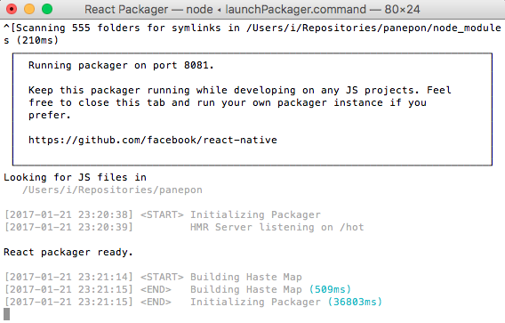

## React Nativeを触ってみた
- [React Native | A framework for building native apps using React](https://facebook.github.io/react-native/)
- とりまチュートリアル進める


### Getting Started
- MacでiOSの方起動してみる
- Nodeはあるので```brew install watchman```
- watchmanはFacebook製のファイル監視ツール
- ```npm i -g react-native-cli```
- Xcodeはすでに入ってる
- Cordova触った時に色々やったしまあ大丈夫だと思う
```
$ react-native init panepon
$ cd panepon
$ react-native run-ios
```
- めっちゃ重い..待つことしばし
- Simulatorと、よく分からない真っ白なターミナルが表示される



- React Packagerなるものだそうな。何者
- [react-native/packager at master · facebook/react-native](https://github.com/facebook/react-native/tree/master/packager)
- BrowserifyとかWebpackみたいなモジュールバンドラーらしい
- 何はともあれSimulatorの方はウェルカムしてくれてる
- index.ios.jsを編集していくらしい
- index.android.jsもあるし、Androidはこっち編集していくみたい
- Learn once, write everywhereを掲げているらしいので、共通のコンポーネントとか作って、それをiOSとAndrodそれぞれに組み込んで作っていく感じかな
- .flowconfigあるし、index.ios.jsに```@flow```って書いてあるしflow使ってるっぽいな..
- まあflowでの型チェックはおいおい落ち着いてからということで
- index.ios.jsの中身見てみる
- 別段言うこともない。CSSだけCSS in JSになってるけど


### ディレクトリ構成
```
.
├── .babelrc
├── .buckconfig
├── .flowconfig
├── .gitattributes
├── .gitignore
├── .watchmanconfig
├── __tests__        # その名の通りテスト用のファイル入ってる
├── android          # Androidのプロジェクトディレクトリっぽい、Android Studioで開けるやつ
├── index.android.js
├── index.ios.js
├── ios              # iOSのプロジェクトディレクトリっぽい、Xcodeで開けるやつ
├── node_modules
└── package.json
```
- .buckconfigはBuckの設定ファイルっぽい
- [Buck: A fast build tool](https://buckbuild.com/)
- Facebook製のビルドツールらしい
- よく分からないけど無視でいいと思う
- あとのファイルは大体分かる


### THE BASICEの残り (Tutorial ~ More Resources)
- 面倒なので適当に章題とかスクショとかだけ見て飛ばす
- いちいちTutorialとかちまちまやってられない性格なので
- タイトル見たら大体何が書いてあるか分かるし、使うときに見ればいいでしょ


### 他のメニュー
- 他もなんとなーく何書いてるか分かる気がする
- やっぱり必要になったときにメニューから探して内容読めばよさそう


## Three.jsとReactの連携を試してみた
- []()
